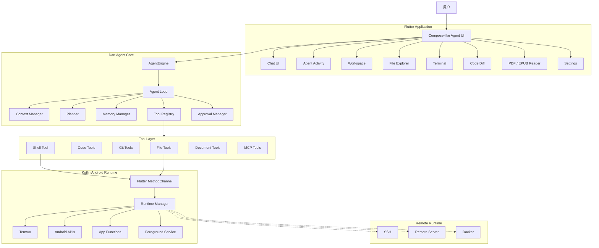
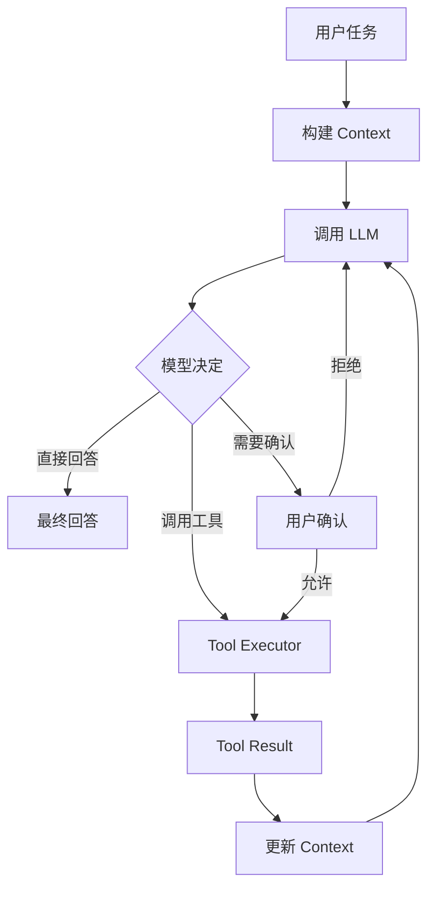
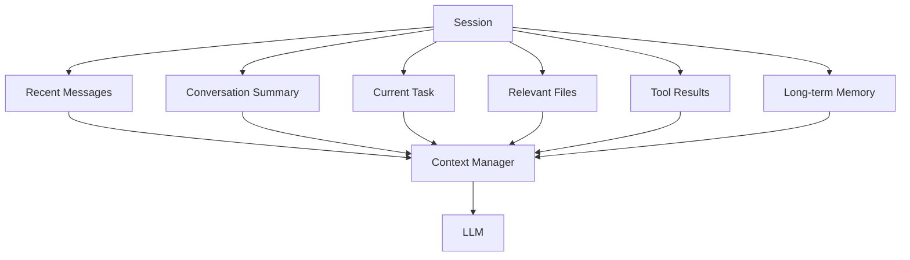
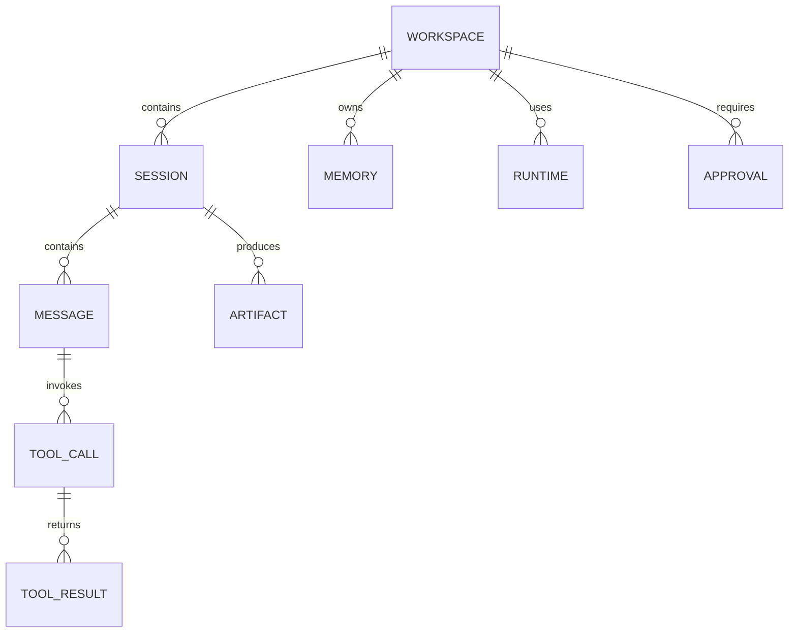

# AgentFlow

> Android AI Agent 工作台
> Flutter + Dart Agent Core + Kotlin Android Runtime + MCP

## 1. 项目定位

**AgentFlow** 是一个面向 Android 的 AI Agent 应用。

它不是传统的聊天机器人，而是让用户通过自然语言向 AI 提出任务，由 Agent 自主完成：

* 阅读文件
* 分析代码
* 修改代码
* 执行命令
* 操作 Git
* 阅读 PDF / EPUB
* 搜索知识
* 调用 MCP 工具
* 使用 Android 系统能力
* 调用远程 Runtime
* 汇总执行结果

核心理念：

```text
用户
 ↓
自然语言任务
 ↓
AgentFlow
 ↓
理解意图
 ↓
制定计划
 ↓
调用工具
 ↓
观察结果
 ↓
继续决策
 ↓
完成任务
```

因此 AgentFlow 的核心不是 Chat，而是：

> **Agent + Tool + Runtime + Context**

---

# 2. 产品目标

## 2.1 第一阶段目标

先实现一个可以真正工作的 Android Coding Agent。

用户可以：

```text
打开 AgentFlow
    ↓
创建 Workspace
    ↓
连接一个代码项目
    ↓
输入：

“分析这个项目为什么启动慢，
找到主要问题并给出修改方案”
    ↓
Agent 读取项目
    ↓
搜索代码
    ↓
分析依赖
    ↓
生成方案
    ↓
等待用户确认
    ↓
修改代码
    ↓
运行测试
    ↓
返回结果
```

---

# 3. 核心设计原则

## 3.1 Chat 只是入口

不要设计成：

```text
ChatGPT
   ↓
回答
```

而是：

```text
Chat
 ↓
Agent
 ↓
Tools
 ↓
Runtime
 ↓
Environment
```

---

## 3.2 Agent 必须可观察

用户应该知道 Agent 当前在做什么。

例如：

```text
● Thinking

正在分析项目结构

✓ list_files
✓ read_file package.json
✓ search_code "WebSocket"
● analyzing dependencies
○ run tests
```

而不是只显示：

```text
AI 正在思考……
```

---

## 3.3 高风险操作需要确认

工具按照风险分级。

| 操作         | 默认策略   |
| ---------- | ------ |
| 读取文件       | 自动     |
| 搜索代码       | 自动     |
| 查看 Git 状态  | 自动     |
| 修改文件       | 确认     |
| 执行 Shell   | 确认     |
| Git Commit | 确认     |
| Git Push   | 强确认    |
| 删除文件       | 强确认    |
| 网络请求       | 根据工具决定 |

---

# 4. 总体架构



---

# 5. 技术栈

## 5.1 Flutter

负责产品层。

```text
Flutter
├── UI
├── Navigation
├── Chat
├── Markdown
├── Agent Activity
├── File Explorer
├── Diff
├── Terminal UI
├── PDF UI
├── EPUB UI
├── Settings
└── Animation
```

推荐：

```text
Flutter
Dart
Riverpod
GoRouter
Drift / SQLite
Freezed
json_serializable
```

---

# 6. Kotlin Android Runtime

Kotlin 不负责整个 App，而负责 Android 特有能力。

```text
Kotlin
├── Android API
├── Permission
├── File Access
├── Termux
├── PTY
├── Foreground Service
├── Notification
├── AppFunctions
├── Media
├── Camera
└── Background Task
```

Flutter 与 Kotlin：

```text
Flutter
   │
   │ MethodChannel
   ▼
Kotlin
   │
   ├── Android
   ├── Termux
   ├── PTY
   └── AppFunctions
```

---

# 7. Agent Core

AgentFlow 最核心的模块。

```text
AgentEngine
│
├── AgentLoop
├── Planner
├── ContextManager
├── ToolRegistry
├── ToolExecutor
├── ApprovalManager
├── MemoryManager
└── ModelProvider
```

---

# 8. Agent Loop

核心循环：



Agent 的核心逻辑：

```dart
while (!finished) {
  final context = contextManager.build();

  final response = await model.generate(context);

  if (response.isFinal) {
    return response;
  }

  if (response.requiresApproval) {
    await approvalManager.waitForApproval();
  }

  final result = await toolExecutor.execute(response.toolCall);

  contextManager.appendToolResult(result);
}
```

---

# 9. Agent 状态机

Agent 不应该只有：

```text
loading
```

建议：

```text
IDLE
 ↓
THINKING
 ↓
PLANNING
 ↓
WAITING_APPROVAL
 ↓
EXECUTING
 ↓
OBSERVING
 ↓
THINKING
 ↓
COMPLETED
```

异常：

```text
EXECUTING
    ↓
ERROR
    ↓
RECOVERING
    ↓
EXECUTING
```

---

# 10. Tool System

所有 Agent 能力统一抽象成 Tool。

```dart
abstract class AgentTool {
  String get name;

  String get description;

  Map<String, dynamic> get inputSchema;

  Future<ToolResult> execute(
    Map<String, dynamic> arguments,
  );
}
```

例如：

```text
read_file
write_file
list_files
search_code
run_shell
git_status
git_diff
git_commit
read_pdf
read_epub
web_search
```

---

# 11. File Tool

### list_files

```json
{
  "path": "."
}
```

返回：

```json
{
  "files": [
    {
      "name": "lib",
      "type": "directory"
    },
    {
      "name": "pubspec.yaml",
      "type": "file"
    }
  ]
}
```

---

# 12. Code Tool

AgentFlow 的 Coding Agent 可以拥有：

```text
search_code
read_code
find_symbol
find_references
get_git_diff
apply_patch
```

后期加入 AST：

```text
Source Code
    ↓
Tree-sitter
    ↓
AST
    ↓
Symbol Index
    ↓
Agent
```

这样 Agent 就不需要每次扫描整个项目。

---

# 13. Shell Tool

Shell 是 AgentFlow 非常重要的能力。

例如：

```text
npm install
npm test
npm run build
python main.py
git status
git diff
```

Android 本身不是完整 Linux 开发环境，因此：

```text
AgentFlow
   ↓
Kotlin Runtime
   ↓
Termux
   ↓
Linux Environment
```

Termux 中可以运行：

```text
Node.js
Python
Git
Rust
Go
Java
```

最终形成：

```text
Android
    │
    ▼
Termux
    │
    ├── Node
    ├── Python
    ├── Git
    ├── Rust
    └── Go
```

---

# 14. Runtime 抽象

不要让 Agent Core 直接依赖 Termux。

定义：

```dart
abstract class Runtime {
  Future<CommandResult> execute(
    String command,
    String workingDirectory,
  );

  Future<String> readFile(String path);

  Future<void> writeFile(
    String path,
    String content,
  );

  Future<List<FileInfo>> listFiles(
    String path,
  );
}
```

然后实现：

```text
Runtime
│
├── AndroidRuntime
├── TermuxRuntime
├── SSHRuntime
├── RemoteRuntime
└── DockerRuntime
```

这样未来可以：

```text
手机 Agent
     │
     ├── 本机项目
     ├── Termux
     ├── SSH Server
     ├── VPS
     └── Docker
```

---

# 15. MCP

AgentFlow 后期接入 MCP。

```text
AgentFlow
    │
    ▼
MCP Client
    │
    ├── GitHub
    ├── Database
    ├── Files
    ├── Browser
    ├── Grafana
    ├── Notion
    └── Custom MCP
```

Agent 不需要知道具体实现。

例如：

```text
用户：

分析我的 Grafana 监控
```

Agent：

```text
调用 MCP
    ↓
查询 Grafana
    ↓
获取 Metrics
    ↓
分析异常
    ↓
生成报告
```

这也可以复用你之前的 AI Ops / Grafana MCP 思路。

---

# 16. Model Provider

模型层也必须抽象。

```dart
abstract class ModelProvider {

  Future<ModelResponse> generate(
    ModelRequest request,
  );

}
```

支持：

```text
OpenAI
Claude
Gemini
DeepSeek
Qwen
OpenAI Compatible
Local Model
```

配置：

```text
Provider
Model
API URL
API Key
Temperature
Context Window
```

例如：

```text
DeepSeek
https://api.deepseek.com

Qwen
OpenAI Compatible

Local
http://127.0.0.1:xxxx
```

---

# 17. Context Manager

Agent 最大的问题之一是 Context。

不能简单：

```text
所有聊天记录
    ↓
全部发送给 LLM
```

应该：



---

# 18. Workspace

Workspace 是 AgentFlow 的核心对象。

```text
Workspace
│
├── Project
├── Sessions
├── Files
├── Git
├── Runtime
├── Memory
└── Settings
```

例如：

```text
MyProject
│
├── workspace.json
├── sessions/
├── memory/
├── artifacts/
└── project/
```

---

# 19. Session

一次任务对应一个 Session。

例如：

```text
Session
标题：

“解决 WebSocket 断线问题”
```

内部：

```text
Session
│
├── User Message
├── Agent Message
├── Tool Call
├── Tool Result
├── Approval
├── Diff
└── Final Result
```

---

# 20. Agent Activity UI

这是 AgentFlow 与普通 AI Chat 最大的 UI 区别。

例如：

```text
┌───────────────────────────────┐
│ AgentFlow                     │
├───────────────────────────────┤
│                               │
│ 帮我分析这个项目启动为什么慢    │
│                               │
│ ┌───────────────────────────┐ │
│ │ Agent Activity             │ │
│ │                            │ │
│ │ ✓ 分析项目结构             │ │
│ │ ✓ 读取 package.json        │ │
│ │ ✓ 搜索 WebSocket           │ │
│ │ ● 分析依赖关系             │ │
│ │ ○ 运行性能测试             │ │
│ │                            │ │
│ └───────────────────────────┘ │
│                               │
│ Agent 正在分析依赖关系...      │
│                               │
└───────────────────────────────┘
```

---

# 21. Diff UI

Agent 修改代码以后，不应该直接覆盖然后告诉用户：

> 已经修改完成。

应该显示：

```text
src/service.ts

- const timeout = 5000;
+ const timeout = 30000;
```

用户：

```text
[拒绝]    [接受]
```

进一步支持：

```text
Accept
Reject
Accept All
Undo
```

---

# 22. Terminal UI

Agent 执行：

```bash
npm test
```

UI：

```text
┌─────────────────────────────┐
│ Terminal                    │
├─────────────────────────────┤
│ $ npm test                  │
│                             │
│ > project@1.0 test          │
│ > vitest                    │
│                             │
│ ✓ auth.test.ts              │
│ ✓ user.test.ts              │
│ ✓ order.test.ts             │
│                             │
│ Test Files: 3 passed        │
│                             │
│ Exit code: 0                │
└─────────────────────────────┘
```

---

# 23. PDF / EPUB

AgentFlow 同时可以作为 AI 阅读器。

架构：

```text
PDF / EPUB
     ↓
Document Parser
     ↓
Document Model
     ↓
Chapter / Page / Paragraph
     ↓
Context
     ↓
AI
```

用户可以：

```text
解释这一页
总结这一章
找出关键概念
建立知识关系
生成问题
与文档对话
```

最终：

```text
Reader
+
AI
+
Agent
```

---

# 24. Voice

后期加入：

```text
语音输入
   ↓
Speech To Text
   ↓
Agent
   ↓
Tool
   ↓
结果
   ↓
Text To Speech
```

例如：

> “打开我的项目，看看今天有没有编译错误。”

Agent：

```text
识别 Workspace
    ↓
读取日志
    ↓
搜索 Error
    ↓
分析
    ↓
回答
```

---

# 25. Camera

Camera 也可以成为 Tool：

```text
camera.capture
```

例如：

```text
用户拍摄：
服务器报错截图

        ↓

OCR

        ↓

Agent

        ↓

识别错误

        ↓

搜索项目代码

        ↓

给出解决方案
```

这样 Camera 不是独立功能，而是 Agent Tool。

---

# 26. 数据模型

推荐 SQLite。

核心表：

```text
workspace
session
message
tool_call
tool_result
artifact
memory
model_provider
runtime
approval
```

关系：



---

# 27. 项目目录

推荐：

```text
agentflow/
│
├── app/
│   ├── lib/
│   │   ├── core/
│   │   │   ├── agent/
│   │   │   ├── context/
│   │   │   ├── memory/
│   │   │   ├── model/
│   │   │   └── approval/
│   │   │
│   │   ├── tools/
│   │   │   ├── filesystem/
│   │   │   ├── shell/
│   │   │   ├── git/
│   │   │   ├── code/
│   │   │   ├── document/
│   │   │   └── mcp/
│   │   │
│   │   ├── runtime/
│   │   │   ├── runtime.dart
│   │   │   ├── termux_runtime.dart
│   │   │   └── remote_runtime.dart
│   │   │
│   │   ├── ui/
│   │   │   ├── chat/
│   │   │   ├── activity/
│   │   │   ├── terminal/
│   │   │   ├── diff/
│   │   │   ├── files/
│   │   │   └── reader/
│   │   │
│   │   └── storage/
│   │
│   └── test/
│
├── android/
│   └── app/
│       └── src/main/kotlin/
│           └── com/agentflow/
│               ├── runtime/
│               ├── termux/
│               ├── pty/
│               ├── appfunctions/
│               └── service/
│
├── docs/
│
└── README.md
```

---

# 28. Flutter ↔ Kotlin Bridge

建议统一定义：

```text
MethodChannel

agentflow/runtime
```

例如：

```text
executeCommand
readFile
writeFile
listFiles
openFile
startTerminal
stopTerminal
requestPermission
```

Flutter：

```dart
final result = await channel.invokeMethod(
  'executeCommand',
  {
    'command': 'git status',
    'cwd': '/workspace/project',
  },
);
```

Kotlin：

```text
MethodChannel
      ↓
RuntimeManager
      ↓
TermuxRuntime
      ↓
Process
```

---

# 29. 不要让 UI 直接调用 Runtime

错误：

```text
ChatPage
   ↓
Termux
```

正确：

```text
ChatPage
   ↓
AgentEngine
   ↓
ToolRegistry
   ↓
ShellTool
   ↓
Runtime
   ↓
Termux
```

这样以后换成 SSH 不需要修改 UI。

---

# 30. MVP

第一版不要一次实现所有功能。

## MVP-1

目标：

> **能够完成一次真正的 Agent Coding Task。**

实现：

```text
Flutter
+
Chat
+
Agent Loop
+
OpenAI Compatible API
+
Tool Registry
+
read_file
+
list_files
+
search_code
+
write_file
+
Git
```

---

## MVP-2

加入：

```text
Kotlin Runtime
Termux
Shell
Terminal UI
Approval
Diff
```

达到：

```text
读取代码
 ↓
分析
 ↓
修改
 ↓
运行测试
 ↓
展示 Diff
```

---

## MVP-3

加入：

```text
PDF
EPUB
Document Agent
```

---

## MVP-4

加入：

```text
MCP
Remote Runtime
SSH
```

---

## MVP-5

加入：

```text
Voice
Camera
Memory
Multi-Agent
```

---

# 31. 第一条完整用户路径

AgentFlow 第一阶段最重要的 Demo：

```text
创建 Workspace
        ↓
选择项目
        ↓
“分析这个项目”
        ↓
Agent list_files
        ↓
Agent read_file
        ↓
Agent search_code
        ↓
Agent 分析
        ↓
输出计划
        ↓
用户确认
        ↓
Agent write_file
        ↓
Agent git_diff
        ↓
用户确认
        ↓
Agent npm test
        ↓
Agent 分析测试结果
        ↓
最终报告
```

最终 UI：

```text
任务
│
├── ✓ 项目分析
│
├── ✓ 问题定位
│
├── ✓ 修改方案
│
├── ✓ 用户确认
│
├── ✓ 修改代码
│
├── ✓ 测试
│
└── ✓ 最终结果
```

---

# 32. AgentFlow 的核心竞争力

不要把产品竞争力建立在：

```text
“我们也能调用 GPT”
```

而应该建立在：

```text
Agent
+
Runtime
+
Workspace
+
Tools
+
Context
+
Documents
+
Code
```

最终形成：

```text
                AgentFlow
                    │
        ┌───────────┼───────────┐
        │           │           │
      Code        Docs        Android
        │           │           │
      Git         PDF         Camera
      Shell       EPUB        Voice
      AST         RAG         Files
        │           │           │
        └───────────┼───────────┘
                    │
                 Agent
                    │
        ┌───────────┼───────────┐
        │           │           │
      Local       Termux      Remote
                              SSH/VPS
```

---

# 33. 第一阶段技术决策

| 模块              | 技术                         |
| --------------- | -------------------------- |
| UI              | Flutter                    |
| Language        | Dart                       |
| Android Runtime | Kotlin                     |
| Agent Core      | Dart                       |
| Database        | SQLite                     |
| State           | Riverpod                   |
| Model           | OpenAI Compatible API      |
| Local Runtime   | Termux                     |
| Native Bridge   | MethodChannel              |
| Code Search     | ripgrep                    |
| Git             | Git CLI / JGit 后备          |
| PDF             | Android PdfRenderer        |
| EPUB            | Readium                    |
| Tool Protocol   | MCP                        |
| Remote          | SSH                        |
| Code AST        | Tree-sitter                |
| Markdown        | Flutter Markdown           |
| Diff            | 自研 Diff UI                 |
| Background      | Android Foreground Service |

---

# 34. 第一版暂时不做

为了控制复杂度，第一版暂时不做：

```text
多 Agent
复杂 RAG
向量数据库
本地大模型
Docker
完整 IDE
在线协作
账号体系
复杂插件市场
自动 Git Push
自动删除文件
```

第一阶段只验证：

> **Agent 是否真的能够在 Android 上完成一个开发任务。**

---

# 35. 最终产品形态

长期来看，AgentFlow 可以从：

```text
AI Chat
```

发展成：

```text
AI Operating Workspace
```

用户面对的不再是：

```text
“问 AI 一个问题”
```

而是：

```text
“给 AI 一个任务”
```

例如：

```text
分析我的项目
```

```text
帮我修复这个 Bug
```

```text
阅读这本 PDF
```

```text
总结今天的服务器异常
```

```text
分析我的 Grafana
```

```text
把这篇文章整理进知识库
```

```text
连接我的 VPS，检查服务状态
```

这些任务最终都统一进入：

```text
                    AgentFlow
                        │
                    Agent Engine
                        │
          ┌─────────────┼─────────────┐
          │             │             │
        Tools        Runtime       Context
          │             │             │
       MCP/Native   Local/SSH      Memory/RAG
          │             │             │
          └─────────────┼─────────────┘
                        │
                      Model
```

**AgentFlow 的核心不是一个 AI 聊天界面，而是一套运行在 Android 上的 Agent Runtime + Workspace。**
